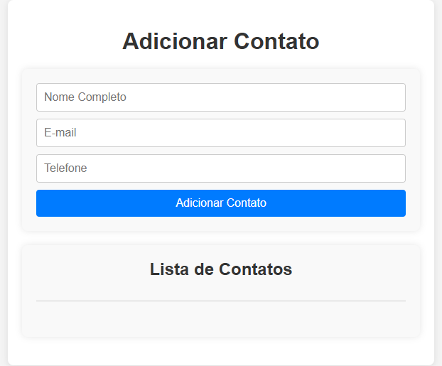
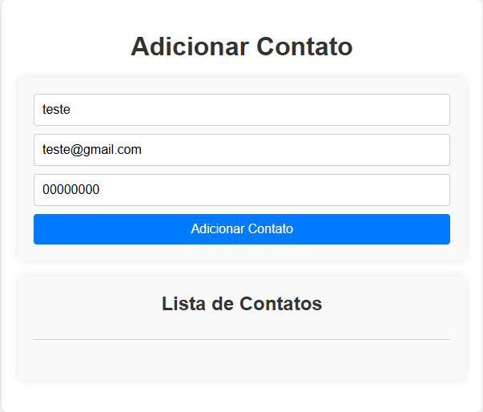
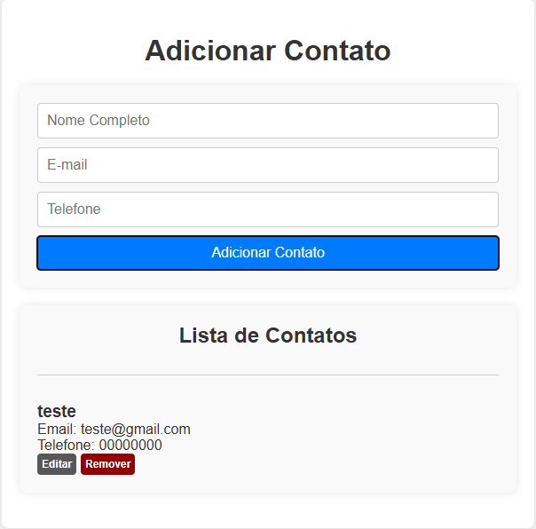
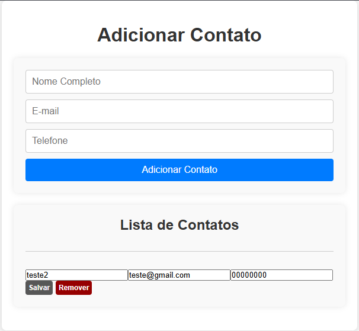
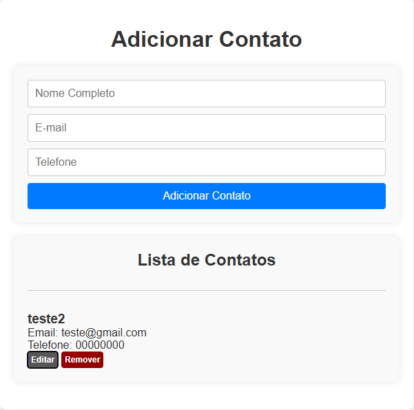
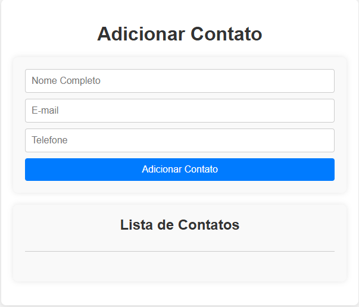

# Lista de Contatos

Este projeto foi iniciado com [Create React App](https://github.com/facebook/create-react-app).

## Comandos para Configurar o Projeto

Para configurar e iniciar o projeto, execute os seguintes comandos no terminal:

```sh
npm i
npm i --save styled-components
npm install --save-dev @types/styled-components
npm i --save react-redux @reduxjs/toolkit
npm install --save-dev @types/uuid
```

## Scripts Disponíveis

No diretório do projeto, você pode executar:

### `npm start`

Executa o aplicativo no modo de desenvolvimento.\
Abra [http://localhost:3000](http://localhost:3000) para visualizá-lo no navegador.

A página será recarregada automaticamente se você fizer alterações no código.\
Você também verá erros de lint no console.

### `npm test`

Inicia o executor de testes no modo interativo.\
Consulte a seção sobre [execução de testes](https://facebook.github.io/create-react-app/docs/running-tests) para mais informações.

### `npm run build`

Cria o aplicativo para produção na pasta `build`.\
Ele agrupa corretamente o React no modo de produção e otimiza a compilação para obter o melhor desempenho.

A compilação é reduzida e os nomes dos arquivos incluem hashes.\
Seu aplicativo está pronto para ser implantado!

Consulte a seção sobre [deploy](https://facebook.github.io/create-react-app/docs/deployment) para mais informações.

### `npm run eject`

**Nota: esta é uma operação sem retorno. Uma vez que você executa `eject`, não pode voltar atrás!**

Se você não estiver satisfeito com a ferramenta de compilação e as escolhas de configuração, pode executar `eject` a qualquer momento. Este comando removerá a dependência única de compilação do seu projeto.

Em vez disso, ele copiará todos os arquivos de configuração e dependências transitivas (webpack, Babel, ESLint, etc.) diretamente no seu projeto para que você tenha controle total sobre eles. Nesse ponto, você estará por conta própria.

Você nunca precisa usar `eject`. O conjunto de recursos curados é adequado para pequenas e médias implantações, e você não deve se sentir obrigado a usar este recurso. No entanto, entendemos que esta ferramenta não seria útil se você não pudesse personalizá-la quando estivesse pronto para isso.

## Aprenda Mais

Você pode aprender mais na [documentação do Create React App](https://facebook.github.io/create-react-app/docs/getting-started).

Para aprender sobre React, consulte a [documentação do React](https://reactjs.org/).

## Fotos e Vídeos

Aqui estão algumas capturas de tela e vídeos demonstrativos do projeto:

### 📸 Capturas de Tela









### 🎥 Vídeos

[Veja o vídeo de demonstração](./midia/lista%20de%20contatos.mp4)
